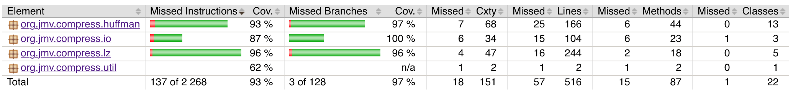

# Testausdokumentti

## Suorituskyky

RunTests-ohjelma ajaa LZ-enkoodauksen ja -dekoodauksen,
Huffman-enkoodauksen ja -dekoodauksen, sekä niiden yhdistelmän
kolmelle eri 50MB kokoiselle testitiedostolle. Ohjelma raportoi
kullekin näistä luettujen ja kirjoitettujen tiedostojen koot,
saavutetun pakkaussuhteen, sekä ajoajan.

Testi-ohjelman saa ajettua näin:

	$ cd compress

	$ mvn package

	$ java -cp target/org.jmv.compress-1.0-SNAPSHOT.jar org.jmv.compress.RunTests

RunBigTests-ohjelma ajaa LZ-enkoodauksen ja -dekoodauksen,
Huffman-enkoodauksen ja -dekoodauksen, sekä niiden yhdistelmän
kolmelle eri 200MB kokoiselle testitiedostolle. Ohjelma raportoi
kullekin näistä luettujen ja kirjoitettujen tiedostojen koot,
saavutetun pakkaussuhteen, sekä ajoajan.

Testidata on sivustolta <http://pizzachili.dcc.uchile.cl/index.html>,
joka ylläpitää testimateriaalia tiiviille tietorakenteille ja
tiedostonpakkaukselle. Testidata koostuu kolmesta tiedostosta, joista
ensimmäinen on DNA:ta, toinen on englannin kielistä tekstiä, ja kolmas
on XML-kieltä. Github ei hyväksy 200MB tiedostoja joten ne täytyy
käydä itse lataamassa jos haluaa toistaa kokeet niille.

Testidatan kuvaukset ovat seuraavat:

- dna: This file is a sequence of newline-separated gene DNA sequences
  (without descriptions, just the bare DNA code) obtained from files
  01hgp10 to 21hgp10, plus 0xhgp10 and 0yhgp10, from Gutenberg
  Project. Each of the 4 bases is coded as an uppercase letter
  A,G,C,T, and there are a few occurrences of other special
  characters.

- english: This file is the concatenation of English text files
  selected from etext02 to etext05 collections of Gutenberg Project.
  We deleted the headers related to the project so as to leave just
  the real text.

- xml: This file is an XML that provides bibliographic information on
  major computer science journals and proceedings and it is obtained
  from dblp.uni-trier.de.

| Lempel-Ziv   | dna.200MB | english.200MB | xml.200MB |
|:-------------|:----------|:--------------|:----------|
| Enkoodaus    | 43,35 sek | 14,12 sek     | 8,97 sek  |
| Dekoodaus    | 4,29 sek  | 4,98 sek      | 3,00 sek  |
| Pakattu koko | 46,4%     | 60,5%         | 24,9%     |

| Huffman      | dna.200MB | english.200MB | xml.200MB |
|:-------------|:----------|:--------------|:----------|
| Enkoodaus    | 3,18 sek  | 5,32 sek      | 6,11 sek  |
| Dekoodaus    | 11,44 sek | 26,66 sek     | 18,51 sek |
| Pakattu koko | 27,5%     | 57,0%         | 66,1%     |

| LZHuffman    | dna.200MB | english.200MB | xml.200MB |
|:-------------|:----------|:--------------|:----------|
| Enkoodaus    | 43,67 sek | 14,08 sek     | 10,18 sek |
| Dekoodaus    | 4,19 sek  | 6,01 sek      | 3,50 sek  |
| Pakattu koko | 46,4%     | 59,4%         | 23,9%     |

### Lempel-Ziv

Lempel-Ziv-pakkaamisessa ikkunan pituutena käytettiin 2^15 merkkiä,
osuman vähimmäispituutena 3 merkkiä, enimmäispituutena 258 merkkiä, ja
enimmillään tarkistettavien osumien lukumääränä 128. Valitsin nämä
luvut koska muutkin Lempel-Ziv-pakkaajat käyttävät suunnilleen
vastaavia lukuja.

Lempel-Ziv-pakkauksella DNA-tiedoston sai pakattua alle puoleen sen
alkuperäisestä koosta. DNA-aakkosto on rajattu, joten on todennäköistä
että DNA-merkkijonosta löytyy toistuvia alimerkkijonoja. Lempel-Ziv
häviää kuitenkin Huffman-koodaukselle, joka saa hyödynnettyä rajattua
aakkostoa paremmin.

Lempel-Ziv on melko tasoissa toisten pakkausmetodien kanssa
englanninkielisen tekstin suhteen, jonka se saa pakattua 60%
alkuperäisestä koosta. Englanninkielisessä tekstissä esiintyy
toistuvasti tiettyjä sanoja, mutta ne eivät välttämättä esiinny
yhdessä, jolloin algoritmi ei välttämättä löydä pitkiä toistuvia
alimerkkijonoja ikkunan sisältä.

Lempel-Ziv suoriutuu selkeästi Huffmania paremmin XML:än kanssa. Koska
XML:ässä on paljon paikallista toisteisuutta, Lempel-Ziv löytää hyviä
osumia nopeasti, ja saa siten pakattua XML:ää tehokkaasti, neljäsosaan
alkuperäisestä koosta.

Lempel-Ziv suoriutuu purkamisessa tasaisesti ja kaikista parhaiten. Se
on algoritmisesti hyvin yksinkertainen ja aikavaadivuudeltaan
lineaariaikainen, joka näkyy ajoajoissa.

### Huffman

Huffman-koodaus suoriutuu selkeästi parhaiten DNA:ta pakatessa.
DNA-aakkosto on hyvin rajallinen (A, C, G, T), ja niiden jakauman voi
olettaa olevan melko tasainen, joten jokainen symboli saa keskimäärin
kahden bitin pituisen koodin. Normaalisti yhden symbolin tallennus vie
tavun, mutta Huffman-koodattuna keskimäärin vain neljäsosan tavusta,
ja tämä myös heijastuu pakkaussuhteessa, joka on lähes neljäsosa
alkuperäisestä.

Dekoodaus on selkeästi hitaampaa kuin enkoodaus, koska yhden symbolin
dekoodauksen aikvaativuus on logaritminen.

Huffman-koodaus on myös hieman parempi muiden pakkaajien suhteen
englanninkielisen tekstin kanssa. Vaikka englanninkielisen tekstin
aakkoston voi olettaa sisältävän kaiki alfanumeeriset merkit, niiden
jakauma on hyvin epätasainen. Englannin kielessä esiintyy paljon
tiettyjä symboleja kuten a, e, i, ja näin ollen Huffman-koodauksesta
saadaan hyötyjä irti.

Isompi aakkosto heijastuu kuitenkin dekoodauksessa, jossa se vie
melkein kaksi kertaa pitempään kuin DNA:lla, koska yhden symbolin
dekoodauksen aikavaativuus on logaritminen.

Huffman-koodaus toimii XML:älle heikommin kuin Lempel-Ziv. XML:ässä
aakkosto sisältää todennäköisesti alfanumeeristen merkkien lisäksi
erikoismerkkejä, ja merkkien jakauma on melko tasainen. Näin ollen
Huffman-puu antaa melkein yhtäpitkiä koodeja kaikille symboleille.

Isosta aakkostosta johtuen XML:än dekoodaus on myös hidasta.

### LZHuffman

LZHuffman toimii muuten kuten Lempel-Ziv-pakkaus, paitsi että se
Huffman-koodaa literaalit. Sen tulokset eivät olleet kovin
merkittävästi Lempel-Ziviä parempia, parhaimmillaan se paransi
pakkausta noin prosentin verran.

Purkaminen oli vain hieman hitaampaa kuin pelkällä Lempel-Zivillä.
LZHuffman-tulokset antavat kuitenkin antoi hyvin osviittaa siitä että
Lempel-Ziv löysi osumia parhaansa mukaan.

## Yksikkötestien kattavuus

