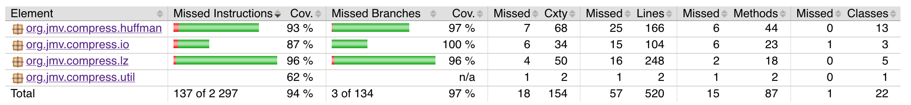

# Testausdokumentti

RunTests-ohjelma ajaa LZ-enkoodauksen ja -dekoodauksen, sekä
Huffman-enkoodauksen ja -dekoodauksen kahdelle eri testitiedostolle.
Ohjelma raportoi kullekin näistä luettujen ja kirjoitettujen
tiedostojen koot, saavutetun pakkaussuhteen, sekä ajoajan.

Testi-ohjelman saa ajettua näin:

    `$ cd compress`

    `$ mvn package`

    `$ java -cp target/org.jmv.compress-1.0-SNAPSHOT.jar org.jmv.compress.RunTests`

Testidata on sivustolta
<http://pizzachili.dcc.uchile.cl/index.html>, joka ylläpitää
testimateriaalia tiiviille tietorakenteille ja tiedostonpakkaukselle.
Testidata koostuu kahdesta 1MB tiedostosta, joista ensimmäinen on
DNA:ta ja toinen on englannin kielistä tekstiä.

## Yksikkötestien kattavuus

